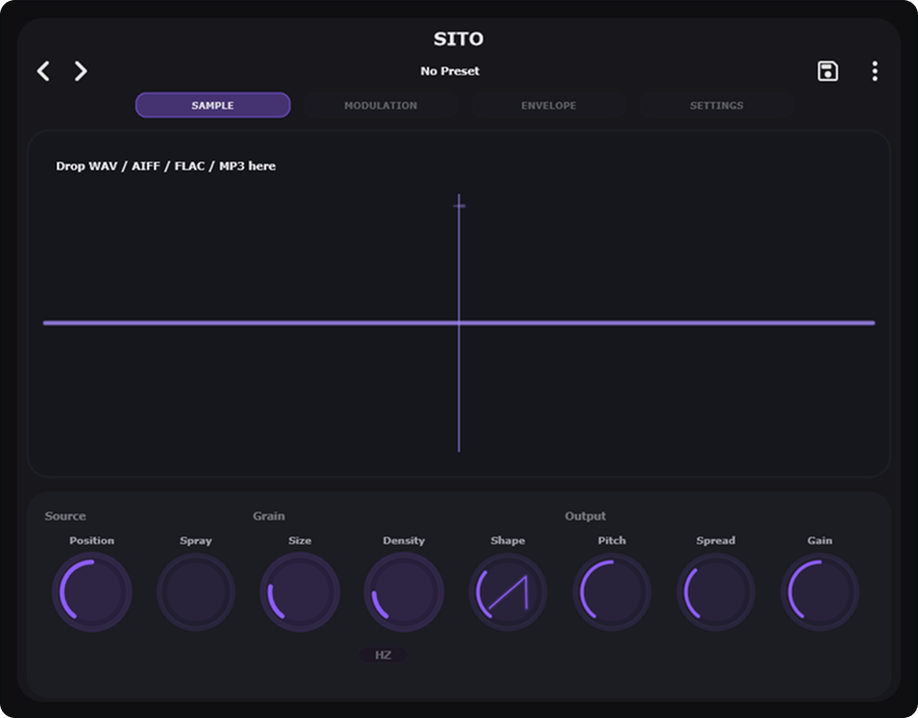
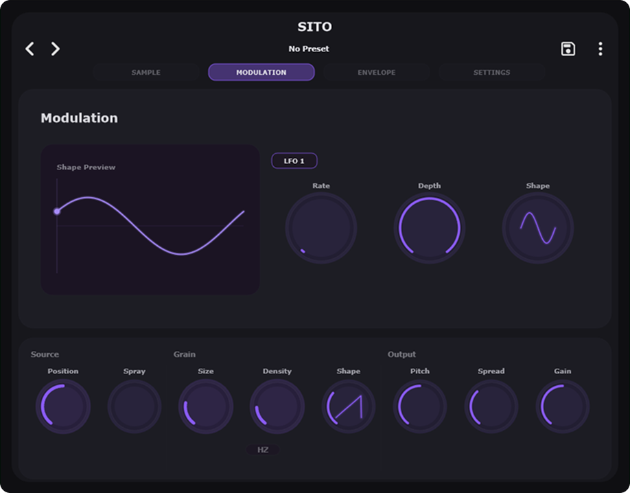

# SITO


SITO is a JUCE-based granular synthesizer plugin built with AI.

# Screenshots





## Table of Contents
### Technical moments
- [Project status](#project-status)
- [Supported output formats](#supported-output-formats)
- [Requirements](#requirements)
- [Quick start](#quick-start)
- [Getting started](#getting-started)
- [GitHub Actions](#github-actions)
- [Notes](#notes)
- [Contributing](#contributing)
### Behind the scenes and my thoughts
- [Backstory](#backstory)
- [Features](#features)
- [Roadmap](#roadmap)

## Project status

This repository is being prepared for open-source release. The current setup includes:

- CMake build system
- Recursive submodules for JUCE and plugin dependencies
- GitHub Actions CI for build/test across Linux, macOS, and Windows
- Catch2 test support

## Supported output formats

- VST3

## Requirements

- Git 2.39+
- CMake 3.25+
- Ninja
- Visual Studio 2022/2026 Build Tools with Desktop development for C++ on Windows, or GCC/Clang on Linux/macOS
- `git submodule` support to fetch JUCE and build dependencies

## Quick start

On Windows, build from an x64 Visual Studio Developer Command Prompt.

```powershell
cd <path-to-sito>
cmake -S . -B build -G Ninja -DCMAKE_BUILD_TYPE=Release
cmake --build build --config Release --target SITO_VST3
```

This will build the VST3 plugin.

The release plugin will be written to:

```text
build/SITO_artefacts/Release/VST3/SITO.vst3
```

Run tests with:

```powershell
cmake --build build --config Release --target SITOTests
ctest --test-dir build --verbose
```

## Getting started

1. Clone the repo with submodules:

```bash
git clone --recurse-submodules https://github.com/underdogme95/sito.git
cd sito
```

If you already cloned without submodules:

```bash
git submodule update --init --recursive
```

2. Create a build directory and configure the project:

```bash
cmake -S . -B build -G Ninja -DCMAKE_BUILD_TYPE=Release
```

On Windows, run this from an x64 Visual Studio Developer Command Prompt.

3. Build the plugin:

```bash
cmake --build build --config Release --target SITO_VST3
```

4. Run tests:

```bash
cmake --build build --config Release --target SITOTests
ctest --test-dir build --verbose
```

## GitHub Actions

This repository includes a cross-platform CI workflow at `.github/workflows/build_and_test.yml`.
It builds, tests, and validates the project on Linux, macOS, and Windows.

## Installation

After a successful build, copy the generated VST3 bundle to your VST3 host plugin directory. Or download VST3 from `Releases`.

Common Windows install locations:

```text
C:\Program Files\Common Files\vst3
```

Then restart your DAW and rescan plugins.

## Notes

- The plugin uses JUCE as a submodule.
- This repository currently targets VST3 only.
- Packaging and notarization are not required for open-source source validation.
- If you want release artifacts, configure signing secrets and update the workflow accordingly.

## Contributing

See `CONTRIBUTING.md` for contribution guidelines.

## Backstory

The project started as an experiment: building a full audio plugin with AI while having almost no prior knowledge of JUCE.
I chose granular synthesis for a reason. I couldn’t find a good, simple, and truly free granular synthesizer that I liked, so I decided to combine the experiment with a practical goal.

## Features

I think the core functionality turned out quite well. The plugin is stable and can be used in real productions. I paid a lot of attention to performance — during testing it showed no major CPU spikes or glitches, and I’m happy with this part.

The GUI was the most painful part for me. I really wanted a nice, minimal interface inspired by Minimal Audio plugins. At the same time I wanted clean code structure and declarative design. Because of this, I got stuck.
The interface is currently in a “it just works” state and partially moved to JIVE (see the `jive` branch). I didn’t manage to reach the visual quality I wanted, so the design is just “okay”.
On the positive side, the plugin has a preset manager, root note setting for samples, and some modulation (currently just one LFO).

## Roadmap

As I said, the project got stuck on the JIVE migration, and at this point I decided to open the source code. I didn’t want to just abandon it, because I believe it has potential — even though the entire plugin was built with AI.
I could have released it much earlier if I didn’t care about quality, but I didn’t want to put out another typical AI-slop plugin. Because of the strong limitations I faced with AI and my lack of deep code understanding, I lost motivation to finish it alone.
This experiment was still successful in my opinion. It showed that with AI you really can create a decent product. Whether it makes sense to open-source your plugin and share the code is a different question — I chose to do both.

___

Thank you for reading!
And even bigger thanks if you got inspired or decide to contribute to the project.